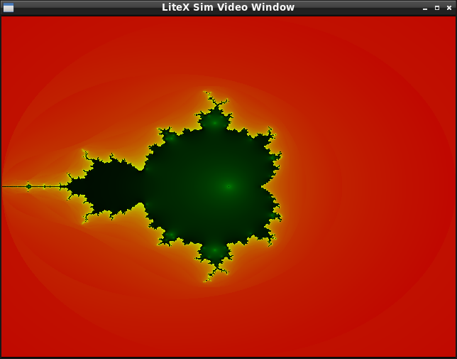
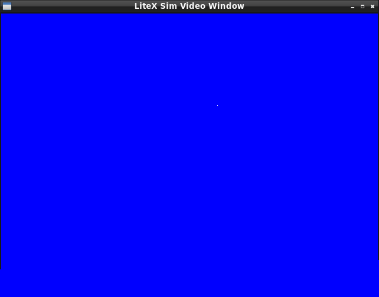
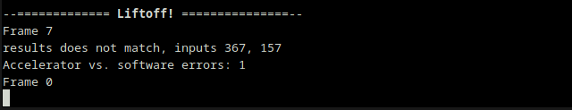
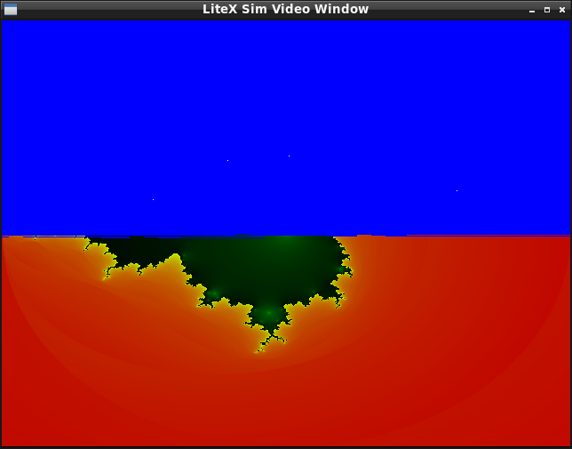

# Floating point data types in hardware accelerators

At the core of this feature, there are some C functions that takes 32-bit values, are interpret them as IEEE-754 compliant single precision types (1-bit sign, 8-bit exponent, and 23-bit mantissa with implicit leading "1"), and do operations like multiplication, division, and addition/substraction, along conversion from/to integers and comparison operators. See in [fp32.cc‎](../../src/fp32.cc) the correspomdig functions *_fp32_mul*, *_fp32_add*, *_fp32_div*, etc. clearly resembling a soft-FPU.  
  
Correctness of the "soft-FPU" was easy to check by comparing with results from a IEEE-754 compliant CPU: the development processor, see *test_random_operations* function.  
  
For correctness of the transpiling of the C source to hardware (Verilog) there's a simulator ([simulator.cpp](simulator.cpp)) that also works as a co-simulation environment, since capable of comparing the simulation of the hardware core with the results of executing the "soft-FPU" C sources in the CPU.  
  
Once the FP32 cores were implemented, an example using them was written: a mandelbrot generator demo using float types. Again, correcteness was tested with the co-simulation tool. That way it was possible to spot bugs like some edge casese (subnormal-values) and some rounding issues.
  

The differences between the hardware core and the host-CPU results are reported and graphically shown as white dots "mismatches" over a blue background (representint bit-exact results). In this case, full precision was used, resulting in just one rounding error as compared with the IEEE-754 compliant CPU:  

  
  
There's also the error report including the coordinate of the mismatch:  
  
  
Note that this FP32 cores are not mean to be fully IEEE-754 compliant, as is usual in FPGAs and GPUs.

## Precision selection

A tradeoff between precision and resource usage arises: if lower precision is acceptable, less resources can be used, particularly hardware multipliers in the FPGA that are scarse (it is best to use native widths for multiplier than larger ones, in the case of the Lattice ECP5 devices, multipliers are 18x18 bits). The "blue screen" can show that frequency of rounding errors (indistinguishable to the eye) has low probability even when cutting multiplier resources in half.  

See how mismatches are progressively reported if ower precision is selected:  
  
  
Note that upper half mirrors the lower half, and so the mismatches.

## Pure-hardware "shaders"

A more complex demo was written: translating the code of a typical GPU shader to hardware. It requires much more calculations to reach the result. As in the previous case, the color corresponding to each pixel is calculated hardwiring gates instead of on a processor (GPU or CPU).

  
Note that the demo was improved with "analytical" antialiasing with custom math to avoid jagged edges int the checkerboard floor and in the sphere, that calculates the exact in-between color for the pixel at onece, with no infrormation from the neighbors nor need of supersampling.  
  
And additional parameter is also considered: a frame number. That way, a series of images of improved graphical detail are generated, depending on frame number. See [human.cc](human.cc) source.
  

The lower precision mode was selected so the shader can fit the low-end of the Lattice ECP5 devices: a 25F version was enough.

## Build

    make clean prerequisites
    make

Target board can be selected with the BOARD environment variable (if not set, a Verilator simulation is run).  
Specific demo (i.e. to switch between the mandelbrot demo and the shader themo) can be selected with MAIN_SRC environment variable.  
  

